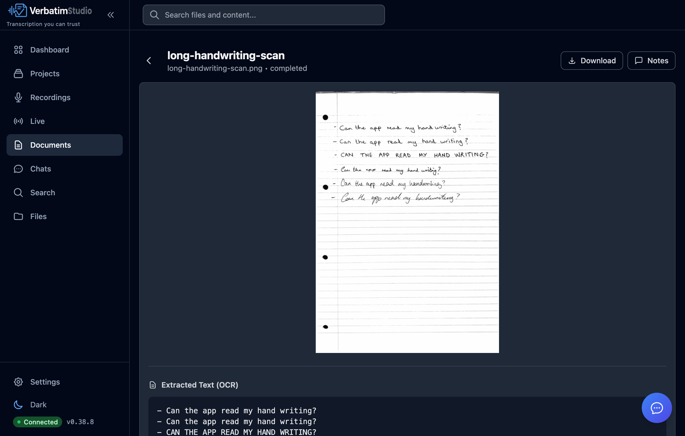
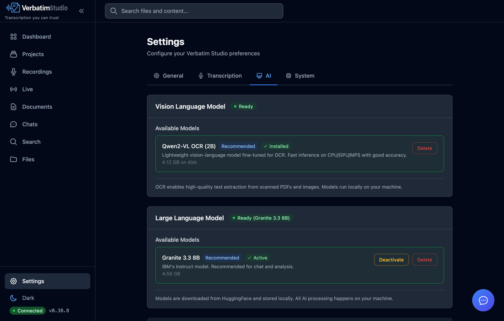

<h1 align="center">
  <br>
  Verbatim Studio
</h1>

<p align="center">
  <strong>Your data. Your device. Your rules.</strong>
</p>

<p align="center">
  <a href="#features">Features</a> •
  <a href="#installation">Installation</a> •
  <a href="#architecture">Architecture</a> •
  <a href="#roadmap">Roadmap</a> •
  <a href="#contributing">Contributing</a>
</p>

<p align="center">
  
  
  
</p>

<p align="center">
  
</p>

---

## Why Verbatim Studio?

Organizations handling confidential information—law firms, medical practices, government agencies, research institutions—face a critical challenge: **cloud transcription services require sending sensitive data to third-party servers.**

Verbatim Studio eliminates this risk entirely. All transcription and AI processing happens locally on your machine. Your files never leave your control.

### Built for Compliance

- **HIPAA-ready** — Patient interviews and medical dictation stay on-premises
- **Legal privilege** — Attorney-client communications remain confidential
- **Government security** — Classified briefings never touch external networks
- **Research ethics** — IRB-protected interviews maintain participant privacy

### Built for Everyone

Verbatim Studio works just as well for everyday use:

- **Project managers** documenting meetings and standups
- **Content creators** transcribing interviews and podcasts
- **Students and academics** processing lectures and research
- **Anyone** who wants accurate transcription without privacy trade-offs or subscription fees

---

## System Requirements

|  | Minimum | Recommended |
|---|---|---|
| **RAM** | 8 GB | 16 GB |
| **Disk** | ~2 GB | ~8 GB |
| **macOS** | Apple Silicon (M1/M2/M3/M4) | Apple Silicon (M1/M2/M3/M4) |
| **Windows** | Coming soon | Coming soon |

**Minimum** covers transcription and basic editing. **Recommended** includes the full AI suite (Max assistant, semantic search, OCR).

> **Memory note:** When the AI model (IBM Granite 8B) is active, it uses approximately 5 GB of resident memory. If you're on a memory-constrained machine, you can deactivate the model in **Settings > AI** to reclaim that memory when you don't need the assistant or AI summaries.

---

## Features

### Transcription That Actually Works

- **OpenAI Whisper accuracy** — State-of-the-art speech recognition running entirely on your Mac
- **Multi-language support** — Transcribe in 12+ languages with automatic detection
- **Automatic speaker identification** — Know who said what without manual tagging
- **Live transcription** — Real-time speech-to-text from your microphone
- **Video support** — Drop in MP4, MOV, WebM, or MKV files and get transcripts automatically

<p align="center">
  
</p>

### Live Transcription

Record directly from your microphone with real-time speech-to-text. Choose your language, enable speaker diarization, and watch the transcript appear as you speak. Save sessions as recordings for later editing and export.

<p align="center">
  
</p>

### Max: Your AI-Powered Verbatim Assistant

Max isn't just a chatbot—it's a research tool that actually understands your content:

- **Query across your entire library** — Ask questions that span multiple files and documents
- **Persistent conversations** — Pick up where you left off with saved chat history
- **Document-aware** — Upload PDFs, images, and notes for Max to reference
- **OCR built-in** — Extract text from scanned documents and images automatically
- **Platform guidance** — Not sure how to do something? Just ask Max

All powered by IBM Granite, running 100% locally. No API keys. No usage limits. No data leaving your machine.

<p align="center">
  
</p>

### Documents & OCR

Upload PDFs and images for automatic text extraction. The built-in OCR model (Qwen2-VL) reads printed text and handwriting alike — all processed locally on your machine.

<p align="center">
  
</p>

### Find Anything, Instantly

- **Semantic search** — Find content by meaning, not just exact keywords
- **Search everything** — Files, transcripts, documents, notes, and chat history in one place
- **Smart results** — See context snippets with keyword highlighting and semantic match indicators

<p align="center">
  
</p>

### Professional Editing Tools

- **Clickable timestamps** — Jump to any moment instantly
- **Highlights and bookmarks** — Mark important segments for quick reference
- **In-transcript search** — Find exactly what you're looking for with highlighted navigation
- **Keyboard-first workflow** — Control playback without leaving your keyboard
- **Inline annotations** — Add notes directly to your documents and transcripts

### Organize Your Way

- **Real folders** — Projects map to actual directories on your filesystem
- **Bulk operations** — Select multiple files and act on them at once
- **Flexible storage** — Keep files local, on network drives, or synced with Google Drive, OneDrive, and Dropbox
- **Full exports** — TXT, SRT, VTT, JSON, or complete backup archives

### Local AI Models

All AI runs on your machine. Download and manage models directly from the settings page — no API keys, no cloud dependencies. Deactivate models when you don't need them to reclaim memory.

<p align="center">
  
</p>

---

## Installation

### Desktop App

Download for your platform:

| Platform | Download | Status |
|----------|----------|--------|
| **macOS (Apple Silicon)** | [Download .dmg](https://github.com/JongoDB/verbatim-studio/releases) | M1/M2/M3/M4 optimized |
| **Windows** | [Download .exe](https://github.com/JongoDB/verbatim-studio/releases) | Nvidia CUDA optimized |

The app is self-contained—no Python, Node.js, or other dependencies required. Just download, install, and run.

### First Launch

On first launch, Verbatim Studio will guide you through downloading the AI models you need. Choose what fits your workflow—transcription only, or the full suite with Max and semantic search.

<details>
<summary><strong>macOS: "App is damaged" or "unidentified developer" warning</strong></summary>

The app is not yet code-signed. To open it:

1. **Right-click** (or Control-click) the app and select **Open**
2. Click **Open** in the dialog that appears

Or, if that doesn't work:

1. Open **System Settings** → **Privacy & Security**
2. Scroll down to find the blocked app message
3. Click **Open Anyway**

**Alternative: Remove quarantine via Terminal**

After downloading, run this command to remove the quarantine attribute:

```bash
xattr -c ~/Downloads/Verbatim.Studio-<version>-arm64.dmg
```

Replace `<version>` with the version number you downloaded (e.g., `0.26.21`).

</details>

<details>
<summary><strong>Development Setup (Build from Source)</strong></summary>

#### Prerequisites

- Python 3.12+
- Node.js 20+
- pnpm 9+
- ffmpeg 7+

#### Clone and Install

```bash
# Clone the repository
git clone https://github.com/JongoDB/verbatim-studio.git
cd verbatim-studio

# Install Node dependencies
pnpm install

# Set up Python environment
cd packages/backend
python -m venv .venv
source .venv/bin/activate
pip install -e ".[dev]"
cd ../..
```

#### Run Development Servers

```bash
# Run both frontend and backend
pnpm dev

# Or run separately
# Terminal 1 - Backend
cd packages/backend && source .venv/bin/activate
python -m uvicorn api.main:app --reload --port 8000

# Terminal 2 - Frontend
cd packages/frontend && pnpm dev
```

Open [http://localhost:5173](http://localhost:5173) in your browser.

</details>

---

## Architecture

<pre align="center">
┌─────────────────────────────────────────────────────────────┐
│                     <b>Frontend</b> (React)                        │
│   Dashboard • Recordings • Projects • Documents • Search    │
├─────────────────────────────────────────────────────────────┤
│                     <b>Backend</b> (FastAPI)                       │
│                                                             │
│    ┌─────────────┐  ┌─────────────┐  ┌─────────────┐       │
│    │  Database   │  │Transcription│  │     AI      │       │
│    │   Adapter   │  │   Engine    │  │   Service   │       │
│    └──────┬──────┘  └──────┬──────┘  └──────┬──────┘       │
│           │                │                │               │
│       SQLite          WhisperX         llama.cpp           │
│                      MLX Whisper        Granite            │
└─────────────────────────────────────────────────────────────┘
</pre>

### Tech Stack

| Layer | Technology |
|-------|------------|
| Frontend | React 18, TypeScript, Vite, Tailwind CSS |
| Backend | FastAPI, SQLAlchemy, Pydantic |
| Transcription | WhisperX, MLX Whisper, pyannote.audio |
| AI/LLM | llama-cpp-python, sentence-transformers |
| OCR | Qwen2-VL (vision-language model) |
| Audio | WaveSurfer.js, ffmpeg |
| Storage | SQLite, Google Drive, OneDrive, Dropbox |

---

## Roadmap

### Current Release (v0.26.x)

**Core Platform**
- [x] Native macOS desktop app (Apple Silicon optimized)
- [x] Native Windows desktop app (Nvidia CUDA optimized)
- [x] Local AI transcription with speaker identification
- [x] Live transcription from microphone
- [x] Video file support with automatic audio extraction
- [x] Automatic update notifications with release notes

**AI Assistant (Max)**
- [x] Multi-document conversations with chat history
- [x] Semantic search across all content
- [x] Platform guidance and help
- [x] OCR for scanned documents and images

**Editing & Organization**
- [x] Clickable timestamps and playback keyboard shortcuts
- [x] Segment highlights and bookmarks
- [x] In-transcript search with navigation
- [x] Inline document annotations
- [x] Project-based organization with real filesystem folders
- [x] Bulk operations

**Storage & Export**
- [x] Local, network, and cloud storage options
- [x] Google Drive, OneDrive, Dropbox integration
- [x] Export to TXT, SRT, VTT, JSON

### Enterprise Tier (Planned)

- [ ] External LLM connections (Ollama, OpenAI, self-hosted)
- [ ] Multi-user with role-based access control
- [ ] Meeting bots for Teams, Google Meet, and Zoom
- [ ] PostgreSQL database support
- [ ] Administration dashboard
- [ ] Audit logging and compliance reports
- [ ] Secure mobile access to self-hosted servers

---

## Configuration

Most settings are available through the **Settings** page in the app.

### AI Models

On first use, Verbatim Studio downloads the AI models you select:

| Model | Size | Purpose |
|-------|------|---------|
| Whisper (base) | ~150 MB | Transcription (pre-bundled; configurable up to large-v3) |
| pyannote | ~200 MB | Speaker diarization |
| nomic-embed-text | ~550 MB | Semantic search (pre-bundled) |
| IBM Granite 3.3 | ~5 GB | AI assistant and transcript summarization |
| Qwen2 VL | ~4.4 GB | Image OCR and document parsing |

Models are cached locally and only download once.

<details>
<summary><strong>Environment Variables (Developers)</strong></summary>

Create a `.env` file in `packages/backend/`:

```bash
# Core settings
VERBATIM_MODE=basic
VERBATIM_DATA_DIR=~/.verbatim-studio

# Transcription
VERBATIM_WHISPERX_MODEL=base
VERBATIM_WHISPERX_DEVICE=auto

# OAuth (optional - for cloud storage)
VERBATIM_GOOGLE_CLIENT_ID=your-client-id
VERBATIM_GOOGLE_CLIENT_SECRET=your-secret
```

</details>

---

## Contributing

Contributions are welcome. See the [Development Setup](#development-setup-build-from-source) section to get started.

### Building the Desktop App

```bash
# Build for your current platform
pnpm build:electron

# Build for specific platform
pnpm build:electron:mac
pnpm build:electron:win
pnpm build:electron:linux
```

### Running Tests

```bash
# Backend tests
cd packages/backend && pytest

# Frontend tests
cd packages/frontend && pnpm test

# Type checking
cd packages/frontend && pnpm typecheck
```

---

## License

MIT License. See [LICENSE](LICENSE) for details.

---

<p align="center">
  <strong>Verbatim Studio</strong> — Transcription you can trust.
</p>

<p align="center">
  <a href="https://github.com/JongoDB/verbatim-studio/issues">Report Issue</a> •
  <a href="https://github.com/JongoDB/verbatim-studio/discussions">Discussions</a>
</p>
