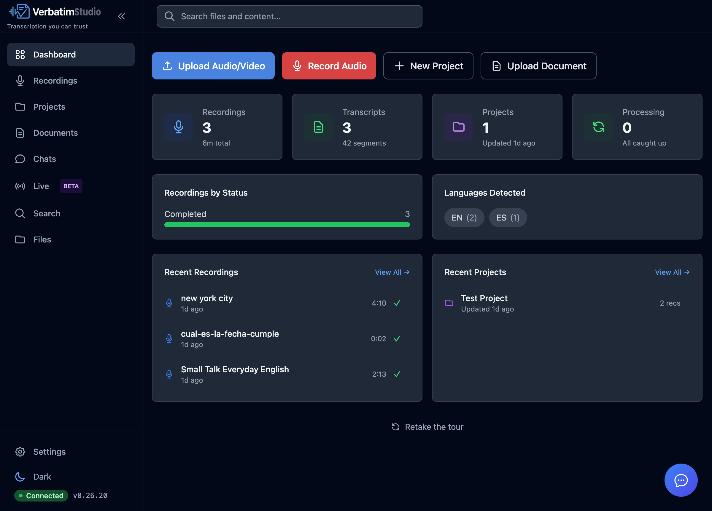
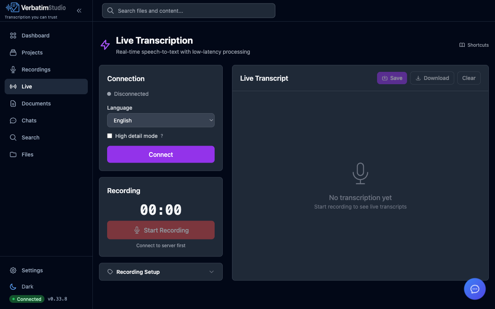
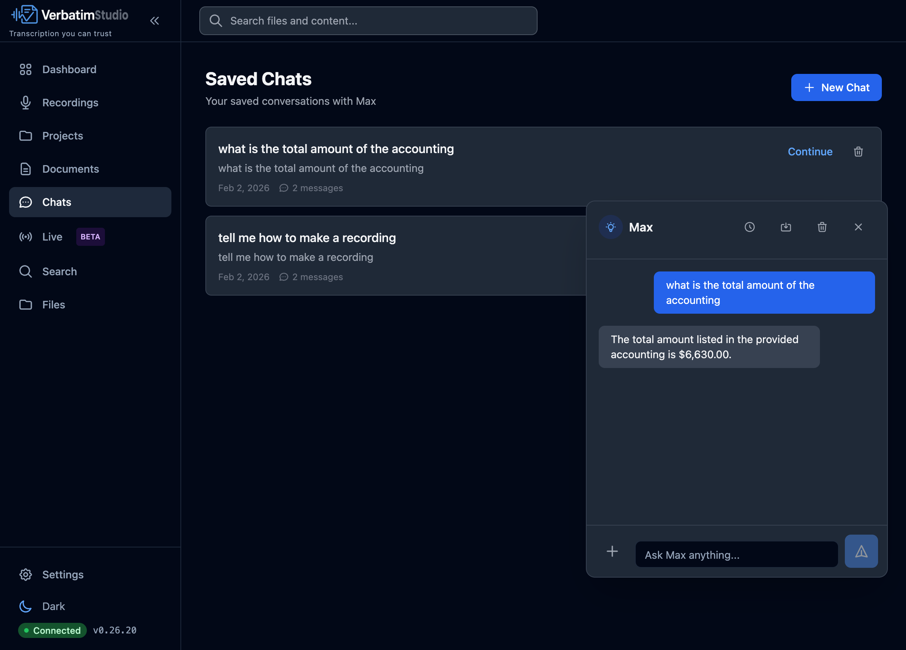
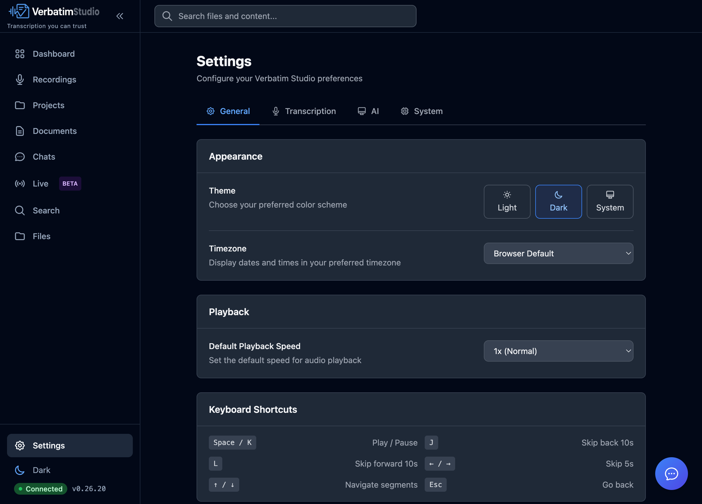

<p align="center">
  
</p>

<h1 align="center">
  <br>
  Verbatim Studio
</h1>

<p align="center">
  <strong>Privacy-first transcription for sensitive workflows</strong>
</p>

<p align="center">
  <a href="#features">Features</a> •
  <a href="#installation">Installation</a> •
  <a href="#quick-start">Quick Start</a> •
  <a href="#architecture">Architecture</a> •
  <a href="#roadmap">Roadmap</a> •
  <a href="#contributing">Contributing</a>
</p>

<p align="center">
  
  
  
  
</p>

---

## Why Verbatim Studio?

Organizations handling confidential information—law firms, medical practices, government agencies, research institutions—face a critical challenge: **cloud transcription services require sending sensitive audio to third-party servers.**

Verbatim Studio eliminates this risk entirely. All transcription and AI processing happens locally on your machine. Your recordings never leave your control.

### Built for Compliance

- **HIPAA-ready**: Patient interviews and medical dictation stay on-premises
- **Legal privilege**: Attorney-client communications remain confidential
- **Government security**: Classified briefings never touch external networks
- **Research ethics**: IRB-protected interviews maintain participant privacy

---

## Features

### Core Transcription

- **Local AI Transcription** — WhisperX and MLX Whisper engines with automatic speaker diarization
- **Live Transcription** — Real-time speech-to-text from microphone input
- **Multi-language Support** — 12+ languages with auto-detection
- **Video Support** — MP4, WebM, MOV, MKV with automatic audio extraction

<p align="center">
  
</p>

### AI-Powered Analysis

- **Max AI Assistant** — Chat with your transcripts, ask questions, generate summaries
- **Semantic Search** — Find content by meaning, not just keywords
- **Local LLM** — All AI runs on-device via llama.cpp (no API keys required)

<p align="center">
  
</p>

### Organization & Export

- **Project Management** — Organize recordings into projects with real folders on your filesystem
- **Document Management** — Upload PDFs, images, and notes with OCR text extraction
- **Export Options** — TXT, SRT, VTT, JSON, and full backup archives
- **Cloud Storage** — Optional sync with Google Drive, OneDrive, and Dropbox

### Professional Interface

- **Dark/Light Mode** — Full theme support with system preference detection
- **Keyboard Shortcuts** — Professional editing workflow with customizable shortcuts
- **Responsive Design** — Works on desktop and tablet devices

<p align="center">
  
</p>

---

## Installation

### Desktop App (Recommended)

Download the latest release for your platform:

| Platform | Download | Notes |
|----------|----------|-------|
| **macOS (Apple Silicon)** | [Download .dmg](https://github.com/JongoDB/verbatim-studio/releases) | M1/M2/M3/M4 optimized with MLX Whisper |
| **macOS (Intel)** | [Download .dmg](https://github.com/JongoDB/verbatim-studio/releases) | x64 with WhisperX |
| **Windows** | [Download .exe](https://github.com/JongoDB/verbatim-studio/releases) | Windows 10/11 x64 |
| **Linux** | [Download .AppImage](https://github.com/JongoDB/verbatim-studio/releases) | Ubuntu 20.04+, Debian, Fedora |

The desktop app is self-contained—no Python, Node.js, or other dependencies required. Just download, install, and run.

### First Launch

On first launch, Verbatim Studio will download the required AI models (~3-5 GB total). This happens once and models are cached locally.

<details>
<summary><strong>macOS: "App is damaged" or "unidentified developer" warning</strong></summary>

The app is not yet code-signed. To open it:

1. **Right-click** (or Control-click) the app and select **Open**
2. Click **Open** in the dialog that appears

Or, if that doesn't work:

1. Open **System Settings** → **Privacy & Security**
2. Scroll down to find the blocked app message
3. Click **Open Anyway**

**Alternative: Download via Terminal to avoid quarantine entirely**

Go to the [Releases page](https://github.com/JongoDB/verbatim-studio/releases), right-click the `.dmg` link, copy the URL, then:

```bash
curl -LO <paste-url-here>
```

Files downloaded via `curl` bypass macOS quarantine, so you won't see security warnings.

</details>

<details>
<summary><strong>Windows: SmartScreen warning</strong></summary>

The app is not yet code-signed. When you see the SmartScreen warning:

1. Click **More info**
2. Click **Run anyway**

</details>

<details>
<summary><strong>Development Setup (Build from Source)</strong></summary>

#### Prerequisites

- Python 3.12+
- Node.js 20+
- pnpm 9+
- ffmpeg 7+

#### Clone and Install

```bash
# Clone the repository
git clone https://github.com/JongoDB/verbatim-studio.git
cd verbatim-studio

# Install Node dependencies
pnpm install

# Set up Python environment
cd packages/backend
python -m venv .venv
source .venv/bin/activate  # or `.venv\Scripts\activate` on Windows
pip install -e ".[dev]"
cd ../..
```

#### Run Development Servers

```bash
# Option 1: Run both frontend and backend
pnpm dev

# Option 2: Run separately
# Terminal 1 - Backend
cd packages/backend && source .venv/bin/activate
python -m uvicorn api.main:app --reload --port 8000

# Terminal 2 - Frontend
cd packages/frontend && pnpm dev
```

Open [http://localhost:5173](http://localhost:5173) in your browser.

#### Platform Notes

**macOS (Apple Silicon)**: Uses MLX Whisper for optimized transcription on M1/M2/M3/M4 chips.

**macOS (Intel) / Linux / Windows**: Uses WhisperX with PyTorch. CUDA support available for NVIDIA GPUs.

</details>

---

## Quick Start

1. **Upload or Record** — Click **Upload Audio/Video** or **Record Audio** on the dashboard
2. **Transcribe** — Processing happens locally on your machine
3. **Review** — Edit speaker names, add highlights, leave comments
4. **Export** — Download as TXT, SRT, VTT, or JSON

---

## Architecture

Verbatim Studio uses a clean adapter-based architecture:

<pre align="center">
┌─────────────────────────────────────────────────────────────┐
│                     <b>Frontend</b> (React)                        │
│   Dashboard • Recordings • Projects • Documents • Search    │
├─────────────────────────────────────────────────────────────┤
│                     <b>Backend</b> (FastAPI)                       │
│                                                             │
│    ┌─────────────┐  ┌─────────────┐  ┌─────────────┐       │
│    │  Database   │  │Transcription│  │     AI      │       │
│    │   Adapter   │  │   Engine    │  │   Service   │       │
│    └──────┬──────┘  └──────┬──────┘  └──────┬──────┘       │
│           │                │                │               │
│       SQLite          WhisperX         llama.cpp           │
│                      MLX Whisper        Granite            │
└─────────────────────────────────────────────────────────────┘
</pre>

### Tech Stack

| Layer | Technology |
|-------|------------|
| Frontend | React 18, TypeScript, Vite, Tailwind CSS |
| Backend | FastAPI, SQLAlchemy, Pydantic |
| Transcription | WhisperX, MLX Whisper, pyannote.audio |
| AI/LLM | llama-cpp-python, sentence-transformers |
| Audio | WaveSurfer.js, ffmpeg |
| Storage | SQLite, Google Drive, OneDrive, Dropbox |

---

## Roadmap

### Current Release (v0.23.x) — Basic Tier

- [x] Local AI transcription with speaker diarization
- [x] Live transcription from microphone
- [x] AI assistant (Max) for transcript analysis
- [x] Semantic search across all content
- [x] Project organization with filesystem folders
- [x] Document management with OCR
- [x] Cloud storage integration (Google Drive, OneDrive, Dropbox)
- [x] Export to TXT, SRT, VTT, JSON
- [x] Dark mode and keyboard shortcuts

### In Development

- [ ] **Desktop App** — Native Electron application for macOS, Windows, Linux
- [ ] **External AI Services** — Connect to Ollama, OpenAI, or self-hosted LLM/WhisperX
- [ ] **S3 Object Storage** — Store media in AWS S3, MinIO, or compatible services
- [ ] **Network Storage** — Mount SMB/NFS shares for centralized media access

### Enterprise Tier (Future)

- [ ] User authentication with RBAC
- [ ] PostgreSQL database support
- [ ] Meeting bots for Teams, Meet, and Zoom
- [ ] Team collaboration with shared projects
- [ ] Audit logging and compliance reports
- [ ] Admin dashboard for service management

See the full [ROADMAP.md](docs/ROADMAP.md) for detailed planning.

---

## Configuration

Most settings are available through the **Settings** page in the app. For advanced configuration:

<details>
<summary><strong>Environment Variables (Developers)</strong></summary>

Create a `.env` file in `packages/backend/`:

```bash
# Core settings
VERBATIM_MODE=basic                 # 'basic' or 'enterprise'
VERBATIM_DATA_DIR=~/.verbatim-studio

# Transcription
VERBATIM_WHISPERX_MODEL=base        # tiny, base, small, medium, large-v3
VERBATIM_WHISPERX_DEVICE=auto       # auto, cpu, cuda, mps

# OAuth (optional - for cloud storage)
VERBATIM_GOOGLE_CLIENT_ID=your-client-id
VERBATIM_GOOGLE_CLIENT_SECRET=your-secret
```

</details>

### AI Models

On first use, Verbatim Studio downloads required AI models:

| Model | Size | Purpose |
|-------|------|---------|
| Whisper (base) | ~150 MB | Transcription (configurable up to large-v3) |
| pyannote speaker diarization | ~200 MB | Speaker identification |
| nomic-embed-text-v1.5 | ~550 MB | Semantic search embeddings |
| IBM Granite 3.3 8B | ~5 GB | AI assistant (optional, 2B lite version available) |

Models are cached in `~/.cache/huggingface/` and only download once.

---

## Contributing

Contributions are welcome. See the [Development Setup](#development-setup-build-from-source) section above to get started.

### Building the Desktop App

```bash
# Build for your current platform
pnpm build:electron

# Build for specific platform
pnpm build:electron:mac
pnpm build:electron:win
pnpm build:electron:linux
```

### Running Tests

```bash
# Backend tests
cd packages/backend && pytest

# Frontend tests
cd packages/frontend && pnpm test

# Type checking
cd packages/frontend && pnpm typecheck
```

### Code Style

- **Frontend**: ESLint + Prettier
- **Backend**: Black + isort + mypy

---

## License

MIT License. See [LICENSE](LICENSE) for details.

---

<p align="center">
  <strong>Verbatim Studio</strong> — Transcription you can trust.
</p>

<p align="center">
  <a href="https://github.com/JongoDB/verbatim-studio/issues">Report Issue</a> •
  <a href="https://github.com/JongoDB/verbatim-studio/discussions">Discussions</a>
</p>
